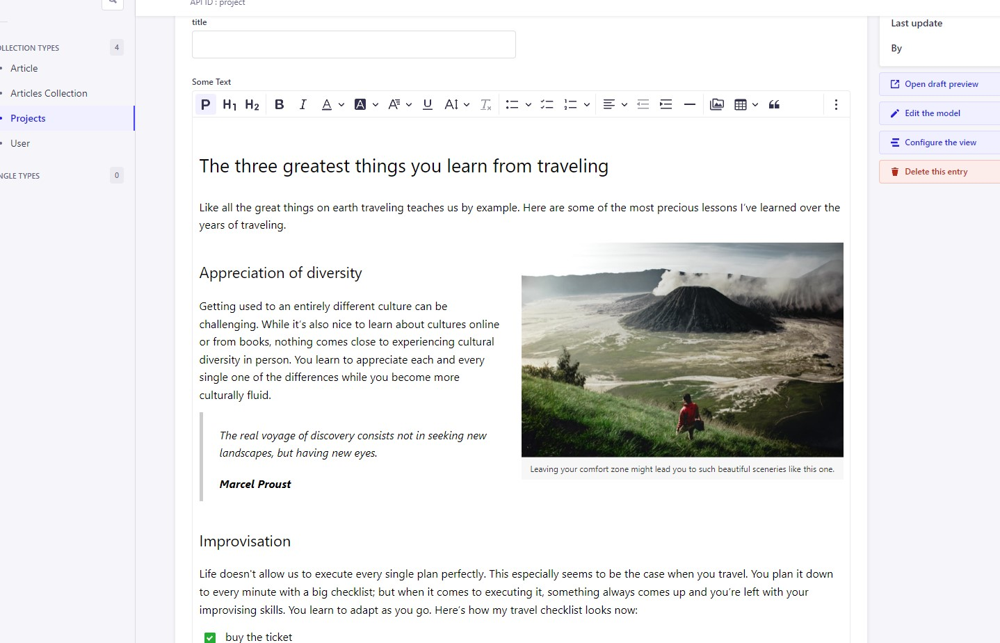
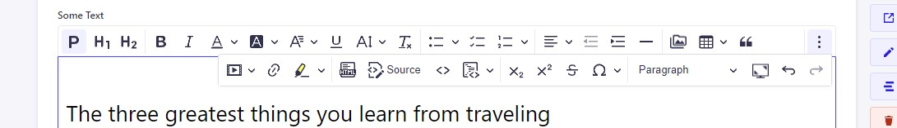
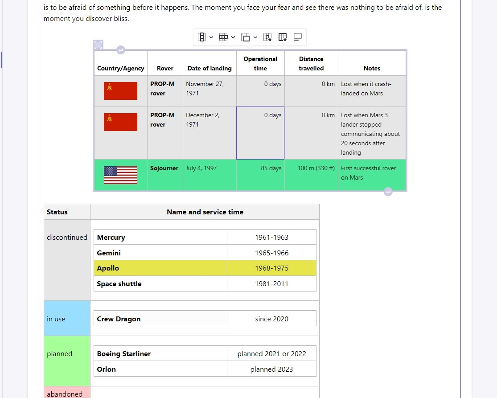
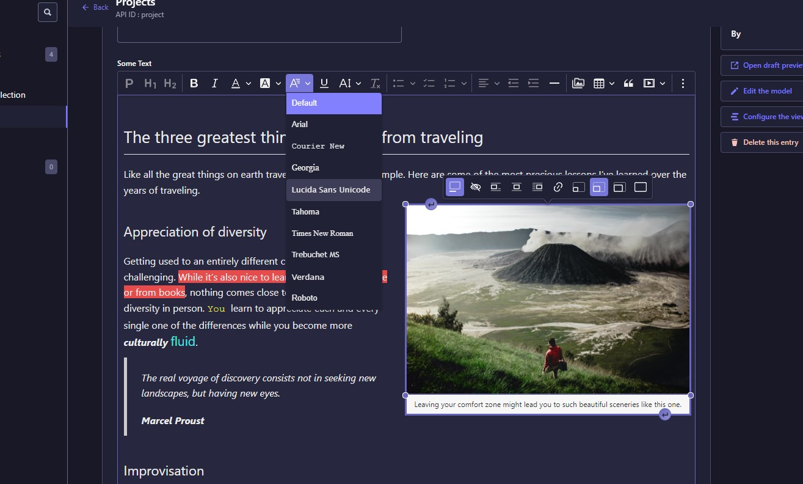
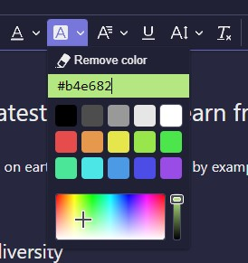
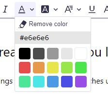

# CKEditor 5 for Strapi 


  
<br/>
  
Replaces the default Strapi WYSIWYG editor with a customized build of CKEditor 5 html editor packed with useful plugins. 
  
The plugin works on custom build of ckeditor based on classic editor build.  
  
Also, this plugin includes some useful plugins based on those repos so thanks to those guys:  
https://github.com/Roslovets-Inc/strapi-plugin-ckeditor5  
https://github.com/leknoppix/ckeditor5-fullscreen  
https://github.com/gtomato/ckeditor5-strapi-upload-plugin  
https://github.com/pshurygin/ckeditor5-font-color  
  


## Plugins
  
<br/>

<br/>
<br/>
  
- <b>Lots of default plugins:</b>
  
    For text styling, images, tables and so on.
<br/>
<br/>
 

  

  
<br/>
<br/>
 
- <b>Fullscreen mode</b>
  

- <b>Font color picker:</b>
  
    Gives you ability to choose colors for font styling that's not defined in config from the color palette.
 
<br/>
 


  
<br/>
 
- <b>Upload udapter:</b>
  
    For upload images to your library when you drop an image into the editor.

 
- <b>Strapi media library button</b>

  
- ```Also supports strapi theme swithing```

- ```Supports responsive images - plugin adds srcset attribute to images based on their "formats"```


## How to install
```
# Install the dependency via npm
npm install @_sh/strapi-plugin-ckeditor
# or yarn
yarn add @_sh/strapi-plugin-ckeditor
```
In ./config/plugins.js file add
```
'ckeditor': {
      enabled: true
}
```
Then run build
```
npm run build
# or
yarn build
```

## How to customize  
  
Via config in plugins.js
  
  Ckeditor settings should be defined in <b>config.editor</b> field
    
  Read more about configuration https://ckeditor.com/docs/ckeditor5/latest/installation/getting-started/configuration.html
    

<details>
  <summary><b>Default config</b></summary>
  
  
  ```javascript

  ckeditor: {
      enabled: true,
      config:{
        plugin:{
       // styles applies to editor container
          styles:``
        },
       // editor default config 
        editor:{
          toolbar: {
            items: [
              'paragraph',
              'heading1',
              'heading2',
              '|',
              'bold',
              'italic',
              'fontColor',
              'fontBackgroundColor',
              'fontFamily',
              'underline',
              'fontSize',
              'removeFormat',
              '|',
              'bulletedList',
              'todoList',
              'numberedList',
              '|',
              'alignment',
              'outdent',
              'indent',
              'horizontalLine',
              '|',
              'StrapiMediaLib',
              'insertTable',
              'blockQuote',
              'mediaEmbed',
              'link',
              'highlight',
              '|',
              'htmlEmbed',
              'sourceEditing',
              'code',
              'codeBlock',
              '|',
              'subscript',
              'superscript',
              'strikethrough',
              'specialCharacters',
              '|',
              'heading',
              "fullScreen",
              'undo',
              'redo'
            ]
          },
          fontSize: {
            options: [
                9,
                11,
                13,
                'default',
                17,
                19,
                21,
                27,
                35,
                "tiny",
                "small",
                "big",
                "huge"
            ],
            supportAllValues: false
          },
          fontFamily: {
            options: [
              'default',
              'Arial, Helvetica Neue, Helvetica, Source Sans Pro, sans-serif',
              'Courier New, Courier, monospace',
              'Georgia, serif',
              'Lucida Sans Unicode, Lucida Grande, sans-serif',
              'Tahoma, Geneva, sans-serif',
              'Times New Roman, Times, serif',
              'Trebuchet MS, Helvetica, sans-serif',
              'Verdana, Geneva, sans-serif',
              'Roboto, Roboto Black, Roboto Medium, Roboto Light, sans-serif',
            ],
            supportAllValues: true
          },
          fontColor: {
            columns: 5,
            documentColors: 10,
          },
          fontBackgroundColor: {
            columns: 5,
            documentColors: 10,
          },
          language: 'en',
          image: {
            resizeUnit: "%",
            resizeOptions: [ {
              name: 'resizeImage:original',
              value: null,
              icon: 'original'
            },
            {
              name: 'resizeImage:25',
              value: '25',
              icon: 'small'
            },
            {
              name: 'resizeImage:50',
              value: '50',
              icon: 'medium'
            },
            {
              name: 'resizeImage:75',
              value: '75',
              icon: 'large'
            } ],
            toolbar: [
              'toggleImageCaption',
              'imageTextAlternative',
              'imageStyle:inline',
              'imageStyle:block',
              'imageStyle:side',
              'linkImage',
              'resizeImage:25', 'resizeImage:50', 'resizeImage:75', 'resizeImage:original'
            ]
          },
          table: {
            contentToolbar: [
              'tableColumn',
              'tableRow',
              'mergeTableCells',
              'tableCellProperties',
              'tableProperties',
              'toggleTableCaption'
            ]
          },
          heading: {
            options: [
              { model: 'paragraph', title: 'Paragraph', class: 'ck-heading_paragraph' },
              { model: 'heading1', view: 'h1', title: 'Heading 1', class: 'ck-heading_heading1' },
              { model: 'heading2', view: 'h2', title: 'Heading 2', class: 'ck-heading_heading2' },
              { model: 'heading3', view: 'h3', title: 'Heading 3', class: 'ck-heading_heading3' },
              { model: 'heading4', view: 'h4', title: 'Heading 4', class: 'ck-heading_heading4' },
              { model: 'heading5', view: 'h5', title: 'Heading 5', class: 'ck-heading_heading5' },
              { model: 'heading6', view: 'h6', title: 'Heading 6', class: 'ck-heading_heading6' },
              {
                  model: 'h1b',
                  view: {name: 'h1', classes: 'ck-heading_h1_b'}, title: 'H1 (border)', class: 'ck-heading_heading1', converterPriority: 'high'
              },
              {
                model: 'h2b',
                view: {name: 'h2', classes: 'ck-heading_h2_b'}, title: 'H2 (border)', class: 'ck-heading_heading2', converterPriority: 'high'
              },
              {
              model: 'h3b',
              view: {name: 'h3', classes: 'ck-heading_h3_b'}, title: 'H3 (border)', class: 'ck-heading_heading3', converterPriority: 'high'
              },
              {
                model: 'h4b',
                view: {name: 'h4', classes: 'ck-heading_h4_b'}, title: 'H4 (border)', class: 'ck-heading_heading4', converterPriority: 'high'
              },
              {
                model: 'h5b',
                view: {name: 'h5', classes: 'ck-heading_h5_b'}, title: 'H5 (border)', class: 'ck-heading_heading5', converterPriority: 'high'
              },
              {
                model: 'h6b',
                view: {name: 'h6', classes: 'ck-heading_h6_b'}, title: 'H6 (border)', class: 'ck-heading_heading6', converterPriority: 'high'
              }
            ]
          }
        }
      }
    }
  ```
  
</details>
<br/>

If you want to customize editor styles you should define styles in <b>config.plugin.styles</b> field it will replace default styles applied to the editor
 
Since Strapi resets css styles, it needs some styles to revert back, those styles defined below also check https://ckeditor.com/docs/ckeditor5/latest/installation/advanced/content-styles.html
 
Also for theme colors switching this plugin uses css variables depending on html data-theme attribute, e.g. html[data-theme='light'] or html[data-theme='dark']
  
More info about theming https://ckeditor.com/docs/ckeditor5/latest/framework/guides/deep-dive/ui/theme-customization.html
 
 
<details>
  <summary><b>Example of default colour variables for the light theme</b></summary>

  ```css
  html[data-theme='light'] {
--ck-color-editor-base-text:#1A1A1A;
/* Overrides the border radius setting in the theme. */
--ck-border-radius: 4px;

/* Helper variables to avoid duplication in the colors. */
--ck-color-base-border: #EAEAEF;
--ck-color-base-background:#ffffff;
--ck-custom-background: #ffffff;
--ck-custom-foreground: #dedede;
--ck-custom-border: #EAEAEF;
--ck-custom-white: hsl(0, 0%, 100%);

--ck-color-focus-outer-shadow:#F0F0FF;

--ck-color-base-focus: 	 	#bbbaf1;
--ck-color-base-active: 	    #F0F0FF;
--ck-color-base-active-focus:  #e2e2fd;
/* -- Overrides generic colors. ------------------------------------------------------------- */

--ck-color-base-foreground: var(--ck-custom-background);
--ck-color-focus-border: #4945FF;
--ck-color-text: #32324D;
--ck-color-shadow-drop: hsla(250, 31%, 80%, 0.1);
--ck-color-shadow-inner: hsla(250, 31%, 80%, 0.1);

/* -- Overrides the default .ck-button class colors. ---------------------------------------- */

--ck-color-button-default-background: var(--ck-custom-background);
--ck-color-button-default-hover-background: #F0F0FF;
--ck-color-button-default-active-background: #dedefb;
--ck-color-button-default-active-shadow: #dedefb;
--ck-color-button-default-disabled-background: var(--ck-custom-background);

--ck-color-button-on-background: #F0F0FF;
--ck-color-button-on-hover-background: #dbdbff;
--ck-color-button-on-active-background: #cdcdf8;
--ck-color-button-on-active-shadow: #cdcdf8;
--ck-color-button-on-disabled-background: var(--ck-custom-foreground);

--ck-color-button-action-background: hsl(168, 76%, 42%);
--ck-color-button-action-hover-background: hsl(168, 76%, 38%);
--ck-color-button-action-active-background: hsl(168, 76%, 36%);
--ck-color-button-action-active-shadow: hsl(168, 75%, 34%);
--ck-color-button-action-disabled-background: hsl(168, 76%, 42%);
--ck-color-button-action-text: var(--ck-custom-white);

--ck-color-button-save: hsl(120, 100%, 46%);
--ck-color-button-cancel: hsl(15, 100%, 56%);

/* -- Overrides the default .ck-dropdown class colors. -------------------------------------- */

--ck-color-dropdown-panel-background: var(--ck-custom-background);
--ck-color-dropdown-panel-border: var(--ck-custom-foreground);

/* -- Overrides the default .ck-splitbutton class colors. ----------------------------------- */

--ck-color-split-button-hover-background: var(--ck-color-button-default-hover-background);
--ck-color-split-button-hover-border: var(--ck-custom-foreground);

/* -- Overrides the default .ck-input class colors. ----------------------------------------- */

--ck-color-input-background: var(--ck-custom-background);
--ck-color-input-border: hsl(257, 3%, 43%);
--ck-color-input-text: hsl(0, 0%, 98%);
--ck-color-input-disabled-background: hsl(0, 0%, 97%);
--ck-color-input-disabled-border: rgb(214, 214, 214);
--ck-color-input-disabled-text: hsl(0, 0%, 78%);

/* -- Overrides the default .ck-labeled-field-view class colors. ---------------------------- */

--ck-color-labeled-field-label-background: var(--ck-custom-background);

/* -- Overrides the default .ck-list class colors. ------------------------------------------ */

--ck-color-list-background: var(--ck-custom-background);
--ck-color-list-button-hover-background: #f4f4fb;
--ck-color-list-button-on-background: var(--ck-color-base-active);
--ck-color-list-button-on-background-focus: var(--ck-color-base-active-focus);
--ck-color-list-button-on-text: #271FE2;

/* -- Overrides the default .ck-balloon-panel class colors. --------------------------------- */

--ck-color-panel-background: var(--ck-custom-background);
--ck-color-panel-border: var(--ck-custom-border);

/* -- Overrides the default .ck-toolbar class colors. --------------------------------------- */

--ck-color-toolbar-background: var(--ck-custom-background);
--ck-color-toolbar-border: var(--ck-custom-border);

/* -- Overrides the default .ck-tooltip class colors. --------------------------------------- */

--ck-color-tooltip-background: #3a3955;
--ck-color-tooltip-text: hsl(0, 0%, 93%);

/* -- Overrides the default colors used by the ckeditor5-image package. --------------------- */

--ck-color-image-caption-background: hsl(0, 0%, 97%);
--ck-color-image-caption-text: hsl(0, 0%, 20%);

/* -- Overrides the default colors used by the ckeditor5-widget package. -------------------- */

--ck-color-widget-blurred-border: #cfcffa;
--ck-color-widget-hover-border: #c9c9e4;
--ck-color-widget-editable-focus-background: var(--ck-custom-white);

/* -- Overrides the default colors used by the ckeditor5-link package. ---------------------- */

--ck-color-link-default: hsl(209, 89%, 33%);

}
  ```

</details>

<details>
  <summary><b>Example of customizing</b></summary>
  
  
  
  ```javascript
# plugins.js

const defStyles = require('./styles.js')

  ckeditor: {
      enabled: true,
      config:{
        plugin:{
       // styles aplyies to editor container
          styles:`
          ${defStyles()}
          --ck-color-editor-base-text:red;
          `
        },
       // editor default config 
        editor:{
            //...
        }
          
      }
    }

# styles.js

    const defStyles = () =>`
        ### all default styles from spoiler below ###
    `
    module.exports = defStyles;

  ```
  
</details>
<details>
  <summary><b>Default styles</b></summary>
  
  
  
  ```css
.ck-editor__main {
	--ck-font-face:"Source Sans Pro",system-ui,Roboto,"Helvetica Neue","Helvetica",Arial,sans-serif;
    min-height: ${200 / 16}em;
	color:var(--ck-color-editor-base-text);
	font-family:var(--ck-font-face);
	> div {
	min-height: ${200 / 16}em;
	}
	.ck-editor__editable {
	line-height: initial;
	}
	
	div, applet, object, iframe, 
	h1, h2,h3, h4, h5,h6, p, span,
	pre, a, abbr, acronym,
	address, big, cite, code, del, dfn, 
	em, img, ins, kbd, q, s, samp, small, 
	strike, strong, sub, sup, tt, var, 
	b, u, i, center, dl, dt, dd, ol, 
	ul, li, fieldset, form, label, legend, 
	table, caption, tbody, tfoot, thead, 
	tr, th, td, article, aside, canvas, 
	details, embed, figure, figcaption,
	footer, header, hgroup, menu, nav, output,
	ruby, section, summary, time, mark, audio, video {
	font: revert;
	margin:revert;
	font-family:revert;
	}
	h1, .ck-heading_h1_b {
	font-size: 2.36em;
	line-height: 1.33em;
	padding-top: 1em;
	margin-bottom: 1.67em;
	font-weight: 400;
	}
	h2, .ck-heading_h2_b {
	font-size: 1.68em;
	line-height: 1.68em;
	padding-top: 0.8em;
	margin-bottom: 0.4em;
	padding-bottom: 0.2em;
	font-weight: 400;
	}
	h3, .ck-heading_h3_b{
	font-size: 1.36em;
	line-height: 1.5em;
	padding-top: 0.8em;
	margin-bottom: 0.2em;
	font-weight: 400;
	}
	h4 {
	font-size: 1.15em;
	line-height: 1.4em;
	padding-top: 0.7em;
	margin-bottom: 0.1em;
	font-weight: 400;
	}
	p{
	font-size: 1em;
	line-height: 1.6em;
	padding-top: 0.2em;
	margin-bottom: 0.8em;
	}
	.ck-heading_h1_b, h2.ck-heading_h2_b, .ck-heading_h3_b{
		border-bottom: 1px solid #e9e9e9;
	}
    figcaption{
        background-color: var(--ck-color-image-caption-background);
        caption-side: bottom;
        color: var(--ck-color-image-caption-text);
        display: table-caption;
        font-size: .75em;
        outline-offset: -1px;
        padding: 0.6em;
        word-break: break-word;
    }
        blockquote {}
    .table {
        margin: 0;
    }
    ul.todo-list {
        list-style: none;
        margin:revert;
        color:revert;
        font-family:revert;
        margin-left: 32px;
    }
    ul, ol {
        list-style: initial;
        margin-left: 32px;
    }
    sub{
        vertical-align: sub
    }
    sup{
        vertical-align: super
    }

    
}

/*
 * CKEditor 5 (v34.0.0) content styles.
 * Generated on Wed, 27 Apr 2022 06:51:54 GMT.
 * For more information, check out https://ckeditor.com/docs/ckeditor5/latest/installation/advanced/content-styles.html
 */

:root {
    --ck-color-image-caption-background: hsl(0, 0%, 97%);
    --ck-color-image-caption-text: hsl(0, 0%, 20%);
    --ck-color-mention-background: hsla(341, 100%, 30%, 0.1);
    --ck-color-mention-text: hsl(341, 100%, 30%);
    --ck-color-table-caption-background: hsl(0, 0%, 97%);
    --ck-color-table-caption-text: hsl(0, 0%, 20%);
    --ck-highlight-marker-blue: hsl(201, 97%, 72%);
    --ck-highlight-marker-green: hsl(120, 93%, 68%);
    --ck-highlight-marker-pink: hsl(345, 96%, 73%);
    --ck-highlight-marker-yellow: hsl(60, 97%, 73%);
    --ck-highlight-pen-green: hsl(112, 100%, 27%);
    --ck-highlight-pen-red: hsl(0, 85%, 49%);
    --ck-image-style-spacing: 1.5em;
    --ck-inline-image-style-spacing: calc(var(--ck-image-style-spacing) / 2);
    --ck-todo-list-checkmark-size: 16px;
}

.ck.ck-sticky-panel .ck-sticky-panel__content_sticky{ top:64px }

/* ckeditor5-block-quote/theme/blockquote.css */
.ck-content blockquote {
    overflow: hidden;
    padding-right: 1.5em;
    padding-left: 1.5em;
    margin-left: 0;
    margin-right: 0;
    font-style: italic;
    border-left: solid 5px hsl(0, 0%, 80%);
}
/* ckeditor5-block-quote/theme/blockquote.css */
.ck-content[dir="rtl"] blockquote {
    border-left: 0;
    border-right: solid 5px hsl(0, 0%, 80%);
}
/* ckeditor5-basic-styles/theme/code.css */
.ck-content code {
    background-color: hsla(0, 0%, 78%, 0.3);
    padding: .15em;
    border-radius: 2px;
}
/* ckeditor5-font/theme/fontsize.css */
.ck-content .text-tiny {
    font-size: .7em;
}
/* ckeditor5-font/theme/fontsize.css */
.ck-content .text-small {
    font-size: .85em;
}
/* ckeditor5-font/theme/fontsize.css */
.ck-content .text-big {
    font-size: 1.4em;
}
/* ckeditor5-font/theme/fontsize.css */
.ck-content .text-huge {
    font-size: 1.8em;
}
/* ckeditor5-highlight/theme/highlight.css */
.ck-content .marker-yellow {
    background-color: var(--ck-highlight-marker-yellow);
}
/* ckeditor5-highlight/theme/highlight.css */
.ck-content .marker-green {
    background-color: var(--ck-highlight-marker-green);
}
/* ckeditor5-highlight/theme/highlight.css */
.ck-content .marker-pink {
    background-color: var(--ck-highlight-marker-pink);
}
/* ckeditor5-highlight/theme/highlight.css */
.ck-content .marker-blue {
    background-color: var(--ck-highlight-marker-blue);
}
/* ckeditor5-highlight/theme/highlight.css */
.ck-content .pen-red {
    color: var(--ck-highlight-pen-red);
    background-color: transparent;
}
/* ckeditor5-highlight/theme/highlight.css */
.ck-content .pen-green {
    color: var(--ck-highlight-pen-green);
    background-color: transparent;
}
/* ckeditor5-image/theme/image.css */
.ck-content .image {
    display: table;
    clear: both;
    text-align: center;
    margin: 0.9em auto;
    min-width: 50px;
}
/* ckeditor5-image/theme/image.css */
.ck-content .image img {
    display: block;
    margin: 0 auto;
    max-width: 100%;
    min-width: 100%;
}
/* ckeditor5-image/theme/image.css */
.ck-content .image-inline {
    /*
     * Normally, the .image-inline would have "display: inline-block" and "img { width: 100% }" (to follow the wrapper while resizing).;
     * Unfortunately, together with "srcset", it gets automatically stretched up to the width of the editing root.
     * This strange behavior does not happen with inline-flex.
     */
    display: inline-flex;
    max-width: 100%;
    align-items: flex-start;
}
/* ckeditor5-image/theme/image.css */
.ck-content .image-inline picture {
    display: flex;
}
/* ckeditor5-image/theme/image.css */
.ck-content .image-inline picture,
.ck-content .image-inline img {
    flex-grow: 1;
    flex-shrink: 1;
    max-width: 100%;
}
/* ckeditor5-image/theme/imageresize.css */
.ck-content .image.image_resized {
    max-width: 100%;
    display: block;
    box-sizing: border-box;
}
/* ckeditor5-image/theme/imageresize.css */
.ck-content .image.image_resized img {
    width: 100%;
}
/* ckeditor5-image/theme/imageresize.css */
.ck-content .image.image_resized > figcaption {
    display: block;
}
/* ckeditor5-image/theme/imagecaption.css */
.ck-content .image > figcaption {
    display: table-caption;
    caption-side: bottom;
    word-break: break-word;
    color: var(--ck-color-image-caption-text);
    background-color: var(--ck-color-image-caption-background);
    padding: .6em;
    font-size: .75em;
    outline-offset: -1px;
}
/* ckeditor5-image/theme/imagestyle.css */
.ck-content .image-style-block-align-left,
.ck-content .image-style-block-align-right {
    max-width: calc(100% - var(--ck-image-style-spacing));
}
/* ckeditor5-image/theme/imagestyle.css */
.ck-content .image-style-align-left,
.ck-content .image-style-align-right {
    clear: none;
}
/* ckeditor5-image/theme/imagestyle.css */
.ck-content .image-style-side {
    float: right;
    margin-left: var(--ck-image-style-spacing);
    max-width: 50%;
}
/* ckeditor5-image/theme/imagestyle.css */
.ck-content .image-style-align-left {
    float: left;
    margin-right: var(--ck-image-style-spacing);
}
/* ckeditor5-image/theme/imagestyle.css */
.ck-content .image-style-align-center {
    margin-left: auto;
    margin-right: auto;
}
/* ckeditor5-image/theme/imagestyle.css */
.ck-content .image-style-align-right {
    float: right;
    margin-left: var(--ck-image-style-spacing);
}
/* ckeditor5-image/theme/imagestyle.css */
.ck-content .image-style-block-align-right {
    margin-right: 0;
    margin-left: auto;
}
/* ckeditor5-image/theme/imagestyle.css */
.ck-content .image-style-block-align-left {
    margin-left: 0;
    margin-right: auto;
}
/* ckeditor5-image/theme/imagestyle.css */
.ck-content p + .image-style-align-left,
.ck-content p + .image-style-align-right,
.ck-content p + .image-style-side {
    margin-top: 0;
}
/* ckeditor5-image/theme/imagestyle.css */
.ck-content .image-inline.image-style-align-left,
.ck-content .image-inline.image-style-align-right {
    margin-top: var(--ck-inline-image-style-spacing);
    margin-bottom: var(--ck-inline-image-style-spacing);
}
/* ckeditor5-image/theme/imagestyle.css */
.ck-content .image-inline.image-style-align-left {
    margin-right: var(--ck-inline-image-style-spacing);
}
/* ckeditor5-image/theme/imagestyle.css */
.ck-content .image-inline.image-style-align-right {
    margin-left: var(--ck-inline-image-style-spacing);
}
/* ckeditor5-language/theme/language.css */
.ck-content span[lang] {
    font-style: italic;
}
/* ckeditor5-media-embed/theme/mediaembed.css */
.ck-content .media {
    clear: both;
    margin: 0.9em 0;
    display: block;
    min-width: 15em;
}
/* ckeditor5-list/theme/todolist.css */
.ck-content .todo-list {
    list-style: none;
}
/* ckeditor5-list/theme/todolist.css */
.ck-content .todo-list li {
    margin-bottom: 5px;
}
/* ckeditor5-list/theme/todolist.css */
.ck-content .todo-list li .todo-list {
    margin-top: 5px;
}
/* ckeditor5-list/theme/todolist.css */
.ck-content .todo-list .todo-list__label > input {
    -webkit-appearance: none;
    display: inline-block;
    position: relative;
    width: var(--ck-todo-list-checkmark-size);
    height: var(--ck-todo-list-checkmark-size);
    vertical-align: middle;
    border: 0;
    left: -25px;
    margin-right: -15px;
    right: 0;
    margin-left: 0;
}
/* ckeditor5-list/theme/todolist.css */
.ck-content .todo-list .todo-list__label > input::before {
    display: block;
    position: absolute;
    box-sizing: border-box;
    content: '';
    width: 100%;
    height: 100%;
    border: 1px solid hsl(0, 0%, 20%);
    border-radius: 2px;
    transition: 250ms ease-in-out box-shadow, 250ms ease-in-out background, 250ms ease-in-out border;
}
/* ckeditor5-list/theme/todolist.css */
.ck-content .todo-list .todo-list__label > input::after {
    display: block;
    position: absolute;
    box-sizing: content-box;
    pointer-events: none;
    content: '';
    left: calc( var(--ck-todo-list-checkmark-size) / 3 );
    top: calc( var(--ck-todo-list-checkmark-size) / 5.3 );
    width: calc( var(--ck-todo-list-checkmark-size) / 5.3 );
    height: calc( var(--ck-todo-list-checkmark-size) / 2.6 );
    border-style: solid;
    border-color: transparent;
    border-width: 0 calc( var(--ck-todo-list-checkmark-size) / 8 ) calc( var(--ck-todo-list-checkmark-size) / 8 ) 0;
    transform: rotate(45deg);
}
/* ckeditor5-list/theme/todolist.css */
.ck-content .todo-list .todo-list__label > input[checked]::before {
    background: hsl(126, 64%, 41%);
    border-color: hsl(126, 64%, 41%);
}
/* ckeditor5-list/theme/todolist.css */
.ck-content .todo-list .todo-list__label > input[checked]::after {
    border-color: hsl(0, 0%, 100%);
}
/* ckeditor5-list/theme/todolist.css */
.ck-content .todo-list .todo-list__label .todo-list__label__description {
    vertical-align: middle;
}
/* ckeditor5-page-break/theme/pagebreak.css */
.ck-content .page-break {
    position: relative;
    clear: both;
    padding: 5px 0;
    display: flex;
    align-items: center;
    justify-content: center;
}
/* ckeditor5-page-break/theme/pagebreak.css */
.ck-content .page-break::after {
    content: '';
    position: absolute;
    border-bottom: 2px dashed hsl(0, 0%, 77%);
    width: 100%;
}
/* ckeditor5-page-break/theme/pagebreak.css */
.ck-content .page-break__label {
    position: relative;
    z-index: 1;
    padding: .3em .6em;
    display: block;
    text-transform: uppercase;
    border: 1px solid hsl(0, 0%, 77%);
    border-radius: 2px;
    font-family: Helvetica, Arial, Tahoma, Verdana, Sans-Serif;
    font-size: 0.75em;
    font-weight: bold;
    color: hsl(0, 0%, 20%);
    background: hsl(0, 0%, 100%);
    box-shadow: 2px 2px 1px hsla(0, 0%, 0%, 0.15);
    -webkit-user-select: none;
    -moz-user-select: none;
    -ms-user-select: none;
    user-select: none;
}
/* ckeditor5-table/theme/tablecaption.css */
.ck-content .table > figcaption {
    display: table-caption;
    caption-side: top;
    word-break: break-word;
    text-align: center;
    color: var(--ck-color-table-caption-text);
    background-color: var(--ck-color-table-caption-background);
    padding: .6em;
    font-size: .75em;
    outline-offset: -1px;
}
/* ckeditor5-table/theme/table.css */
.ck-content .table {
    margin: 0.9em auto;
    display: table;
}
/* ckeditor5-table/theme/table.css */
.ck-content .table table {
    border-collapse: collapse;
    border-spacing: 0;
    width: 100%;
    height: 100%;
    border: 1px double hsl(0, 0%, 70%);
}
/* ckeditor5-table/theme/table.css */
.ck-content .table table td,
.ck-content .table table th {
    min-width: 2em;
    padding: .4em;
    border: 1px solid hsl(0, 0%, 75%);
}
/* ckeditor5-table/theme/table.css */
.ck-content .table table th {
    font-weight: bold;
    background: hsla(0, 0%, 0%, 5%);
}
/* ckeditor5-table/theme/table.css */
.ck-content[dir="rtl"] .table th {
    text-align: right;
}
/* ckeditor5-table/theme/table.css */
.ck-content[dir="ltr"] .table th {
    text-align: left;
}
/* ckeditor5-code-block/theme/codeblock.css */
.ck-content pre {
    padding: 1em;
    color: hsl(0, 0%, 20.8%);
    background: hsla(0, 0%, 78%, 0.3);
    border: 1px solid hsl(0, 0%, 77%);
    border-radius: 2px;
    text-align: left;
    direction: ltr;
    tab-size: 4;
    white-space: pre-wrap;
    font-style: normal;
    min-width: 200px;
}
/* ckeditor5-code-block/theme/codeblock.css */
.ck-content pre code {
    background: unset;
    padding: 0;
    border-radius: 0;
}
/* ckeditor5-horizontal-line/theme/horizontalline.css */
.ck-content hr {
    margin: 15px 0;
    height: 4px;
    background: hsl(0, 0%, 87%);
    border: 0;
}
/* ckeditor5-mention/theme/mention.css */
.ck-content .mention {
    background: var(--ck-color-mention-background);
    color: var(--ck-color-mention-text);
}
@media print {
    /* ckeditor5-page-break/theme/pagebreak.css */
    .ck-content .page-break {
        padding: 0;
    }
    /* ckeditor5-page-break/theme/pagebreak.css */
    .ck-content .page-break::after {
        display: none;
    }
}
  ```
  
</details>
 
<br/>   

## Requirements
Strapi v4
  
Tested on v4.18